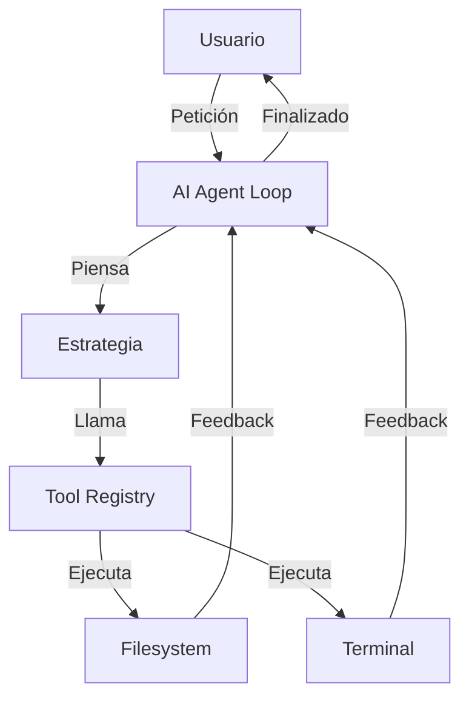

# 🤖 Road to Agentic AI: "Nano-Agent" Architecture

Para que NanoEditor funcione exactamente como **Antigravity**, debemos evolucionar de un modelo de "Asistente Reactivo" a un modelo de "Agente Autónomo". Aquí tienes los cambios técnicos necesarios.

## 1. El Bucle de Pensamiento (The Agent Loop)
Actualmente, el usuario hace una pregunta y la IA responde. Un agente funciona en un bucle:
1.  **Observación**: Ver el estado del editor y archivos.
2.  **Pensamiento**: Planear el siguiente paso.
3.  **Acción**: Ejecutar una herramienta (escribir código, correr un test).
4.  **Feedback**: Ver el resultado de la acción y repetir.

### Cambio Sugerido:
Crear una clase `AIAgent` en `ai_agent.py` que gestione este estado y mantenga un historial de "razonamiento".

## 2. Sistema de Herramientas (Tool Calling)
Antigravity no solo escribe texto; llama a funciones. Necesitamos un **Tool Registry** que permita a la IA:
-   `read_file(path)`
-   `write_file(path, content)`
-   `run_terminal_command(cmd)`
-   `list_directory(dir)`

### Cambio Sugerido:
Modificar `ai_client.py` para soportar la definición de herramientas (JSON schema) y procesar las peticiones de herramientas de la IA.

## 3. Integración con la Terminal
Un agente "real" puede autocorregirse. Si la IA escribe un código con un error de sintaxis, debería poder ejecutarlo en la terminal, ver el error y arreglarlo.

### Cambio Sugerido:
Conectar `TerminalPanel` con el agente para capturar el `stdout` y `stderr` y enviarlo de vuelta al prompt del agente.

## 4. Gestión de Tareas (Task Tracking)
Implementar una interfaz de "Tareas" similar a la mía (`task.md`). Esto permite al usuario ver exactamente en qué paso del plan está la IA.

## 5. Arquitectura Propuesta

## Resumen de Archivos a Crear/Modificar
- `ai_agent.py`: [NUEVO] El cerebro del bucle.
- `ai_tools.py`: [NUEVO] Definición de herramientas disponibles.
- `ai_client.py`: [MODIFICAR] Soporte para Tool Calling de Vertex/Gemini.
- `terminal_panel.py`: [MODIFICAR] API para que el agente lea la salida.
